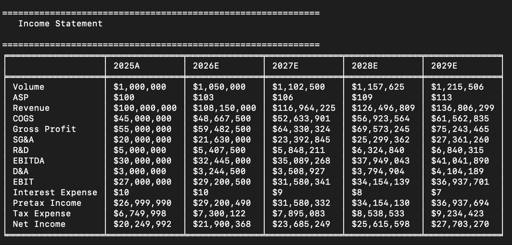
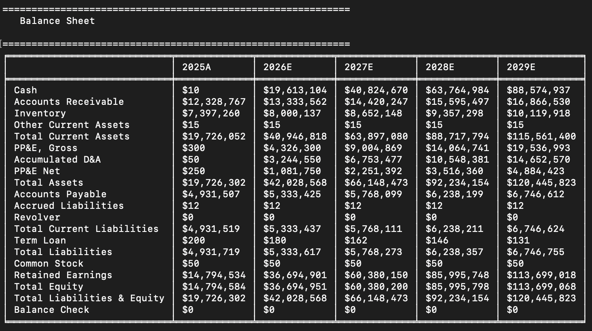
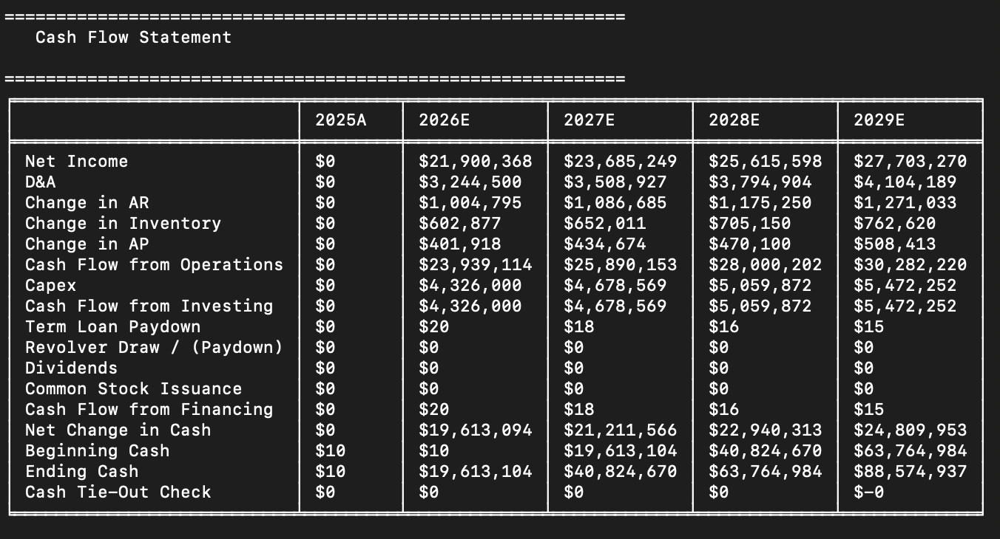

# Three Statement Financial Model

A fully linked income statement, balance sheet, and cash flow statement built from scratch in Python. 

Revenue is driven bottoms-up using a volume X ASP driver formula rather than from a YOY growth rate. Working capital flows through DSO, DIO, and DPO assumptions. A revolving credit line auto-draws and auto-repays based on calculated free cash sweep. And the interest expense circularity is resolved using an iterative covergence function, similar to the iteration calculation mode in Excel.

The model self-verifies through an automated balance check (confirms Assets = Liabilities + Equity) in every period. And a cash tie-out check confrims that independetly calculated ending cash on from the cash flow statement matches the debt schedule's ending cash from its cash sweep function.

##Quick Start

git clone https://github.com/charlescarson17/three-statement-financial-model.git  
cd three-statement-financial-model   
python3 -m venv venv   
source venv/bin/activate      # Mac/Linux   
venv\Scripts\activate         # Windows   
pip install -r requirements.txt   
python3 main.py   

Run the test suite:   
python3 -m pytest -v

##Sample Output

##Key Design Decisions

**Revenue built from volume X ASP, not a YOY growth rate.** This separates the two ditinct inputs of revenue to answer the business question: "Is growth coming from more units sold or from pricing power?".

**Retained earnings acts as the anchor year plug.** Without a full historical balance sheet, retained earnings is the standard place to absorb whatever value is needed to make the opening balance sheet balance. Retained earnings is the natural choice since it represents the cumulative effect of all prior years' undistributed earnings.

**Interest expense circularity resolved via iterative convergence.** Interest expense creates a circularity becaause interest expense depends on the debt balance, which depends on the cash sweep, which depends on net income, which depends on interest expense. This method was chosen over the average-balance method because it resembles how Excel's iterative calculation mode resolves the same circular reference. The model feeds each iteration's calculated interest expense into the next iteration until the change between interations is below a $0.01 tolerance (defined in module).

**Revolve with automatic cash sweep.** Rather that a static debt schedule, the revolver auto-draws if projected cash falls below a defined minimum target and auto-pays with any projected excess cash.

**Single opening balance source of truth.** Anchor year assumptions (cash, PP&E, common stock, etc.) line in one place. This was designed rathered than having the assumptions be duplicated across multiple modules. This creates real coordination necessary in dynamic real-world models and reduces risk during any assumption updates.

##Architecture Summary

The model is build as a procedural pipeline. Each module is a calculation function that receives the outputs of upstream modules, performs its individual contribution to the overall model, and returns a DataFrame. This concept match how a model functions in Excel.

Calculation Order:
Opening Balances & Drivers -> Income Statement -> Working Capital -> Debt Schedule -> Equity Schedule -> Balance Sheet -> Cash Flow Statement  
***All looped until interest expense converges***

##Architecture Components:

- opening_balances.py -> single source of truth for anchor year balances
- drivers.py -> forecast assumptions (volume,      ASP, margins, DSO/DIO/DPO, rates)
- income_statement.py -> Volume X ASP -> Revenue ->...-> Net Income
- working_capital.py -> AR/Inventory/AP from DSO/DIO/DPO
- debt_schedule.py -> term loan amortization + revolver cash sweep
- equity_schedule.py -> retained earning rollforward
- balance_sheet.py -> assembles all balance sheet inputs into a structured balance sheet, auto-balance check
- cash_flow.py -> independent calculation of CFO/CFI/CFF statements, ties out ending cash to debt schedule
- model_runner.py -> orchestrates the pipeline, resolve circularity of interest expense via an iterative convergence function
- formatting.py -> terminal formatting applied to produced financial statements
- main.py -> main entry point to run entire model

##Modeling Assumptions & Limitations

**Other Current Assets and Accrued Liabilities held flat at their anchor year levels.** These balances don't scale with revenue or COGS in the same way as working capital in this model.

**Revolver has no maximum draw limit.** Real credit mechanisms has a maximum committment or borrowing base. The model assumes unconstrained liquidity access.

**Interest rates and tax rates are static.** A single flat rate applies to every period. No yield curve. No effective tas rate shifts.

**Anchor year is a single historical period.** No multi-year historical reference limits any trend-based judgement.

##Testing

Run test:  
python3 -m pytest -v

Runs 8 tests covering income statement math, working capital formula accuracy, debt schedule conditions, balance sheet and cash flow checks, and convergence of the iterative function.

